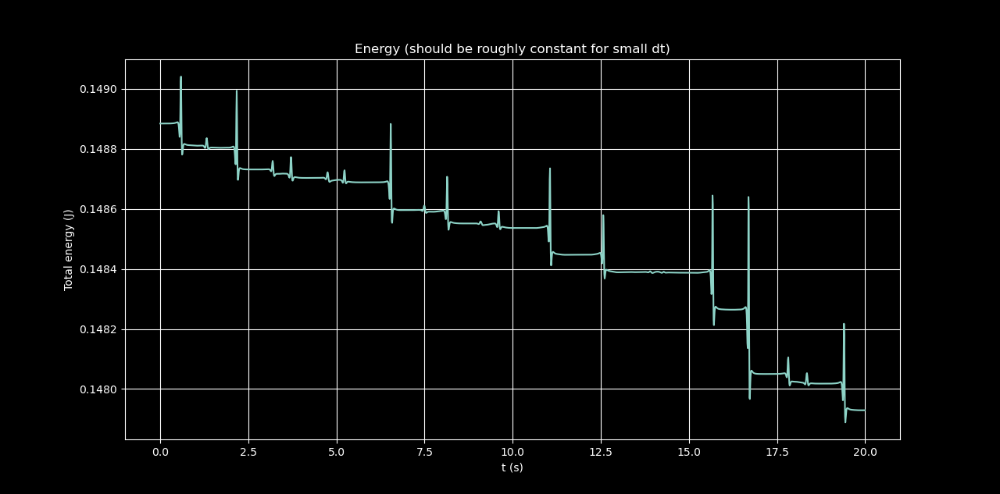

# Double_pendulum

This is a numerical simulation of the double pendulum in Python using Runge Kutta 4 integration. Includes Matplotlib animation with motion trace.
It demonstrates nonlinear and chaotic dynamics with **Runge–Kutta 4th order integration (RK4)** and real-time **Matplotlib animation**.  
Additionally, it includes trajectory traces and energy diagnostics to verify conservation laws. 

## Features: 

- RK4 numerical integration of the equations of motion.  
- Real-time animation with Matplotlib.  
- Trajectory trace of the second mass.
- Energy calculation (kinetic + potential) to check total energy conservation.
- Animation exportation to GIF.

## Installation

Clone the repository and install dependencies:
```bash
git clone https://github.com/yourusername/simulation_double_pendulum.git
cd simulation_double_pendulum
pip install -r requirements.txt
```
Next, just run the simulation and animation
```
python pendulum_lagrangian.py
python pendulum_animation.py
```

## Visual results

After running the python files, you will see:

Animation: chaotic motion of the double pendulum.


Energy plot: shows that the total energy remains approximately constant (for small time steps).




